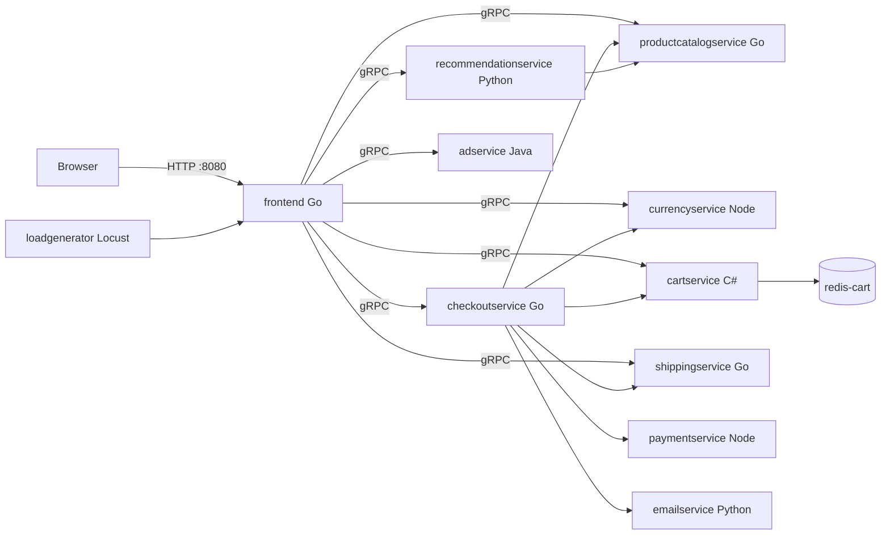
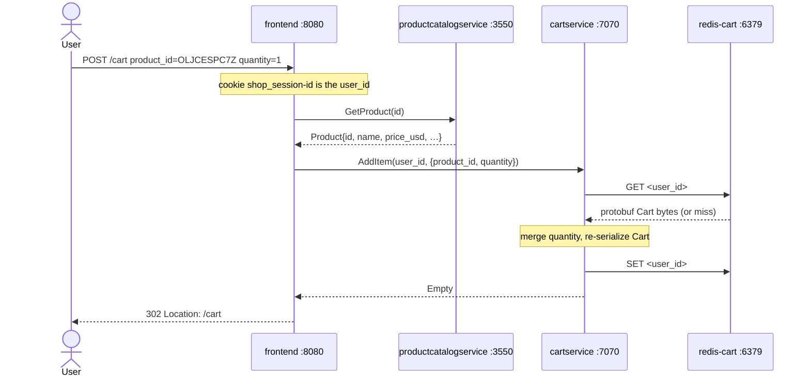
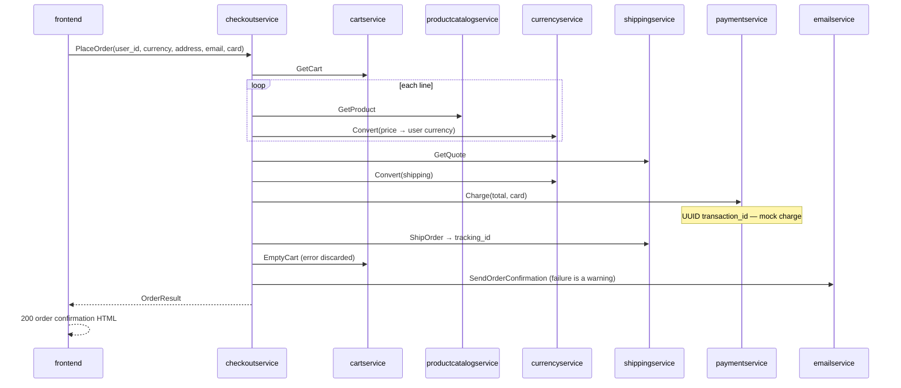

# Storefront breakdown: how Online Boutique actually works

This document is a source-level walkthrough of the shop. It exists so that
"walk me through Add to Cart" is an answer from the code, not a guess from a
diagram.

Contract: [`protos/demo.proto`](../protos/demo.proto). Every backend RPC below
is defined there. The browser never speaks gRPC — only the Go frontend does.

## The shape of the system

Eleven application services plus Redis. One process is an HTTP BFF
(backend-for-frontend). Everything else is gRPC. Languages are mixed on
purpose: Go, C#, Java, Node.js, Python.



| Service | Language | Port | Role |
| --- | --- | --- | --- |
| `frontend` | Go | 8080 HTTP | The only user-facing process. Renders HTML, holds gRPC clients. |
| `productcatalogservice` | Go | 3550 | Reads `products.json`. List / get / search. |
| `cartservice` | C# | 7070 | Cart CRUD. Persistence is Redis (Spanner/AlloyDB are unused forks of the store). |
| `redis-cart` | Redis | 6379 | Cart bytes keyed by session UUID. `emptyDir` — carts die with the pod. |
| `currencyservice` | Node.js | 7000 | Converts `Money` using ECB-style rates. Highest QPS on a browse. |
| `recommendationservice` | Python | 8080 | Returns up to 5 random product IDs *not* already in the cart. Best-effort. |
| `shippingservice` | Go | 50051 | Quote is `$8.99` if the cart is non-empty, else `$0`. Ship returns a fake tracking ID. |
| `checkoutservice` | Go | 5050 | Orchestrates PlaceOrder. The only service that talks to payment and email. |
| `paymentservice` | Node.js | 50051 | Validates VISA/Mastercard and returns a UUID. No money moves. |
| `emailservice` | Python | 5000 | Dummy mode: logs the request, sends nothing. |
| `adservice` | Java | 9555 | Category-keyed text ads. Frontend gives it 100 ms and ignores failure. |
| `loadgenerator` | Python/Locust | — | Synthetic shoppers hitting the frontend. Scale to 0 on a 2-CPU cluster. |

`shoppingassistantservice` exists in `src/` and the frontend env, but it is
gated on `ENABLE_ASSISTANT=true` and is not part of the default path.

## How the frontend finds backends: DNS + env vars

This is the answer to "how does frontend find cartservice?"

1. The frontend **refuses to start** unless every `*_SERVICE_ADDR` env var is
   set (`mustMapEnv` in [`src/frontend/main.go`](../src/frontend/main.go)).
   That is why `docker run` of the frontend image alone dies immediately —
   there are no backends, so there are no addresses.
2. The release manifest hard-codes Kubernetes Service DNS names:

   ```
   CART_SERVICE_ADDR=cartservice:7070
   ```

   [`release/kubernetes-manifests.yaml`](../release/kubernetes-manifests.yaml)
   does the same for product catalog, currency, recommendation, shipping,
   checkout, ads, and the shopping assistant.
3. `cartservice` is a **ClusterIP Service**. CoreDNS resolves that name to the
   Service IP (`cartservice.default.svc.cluster.local`, shortened to
   `cartservice` in the same namespace). kube-proxy (or IPVS) load-balances
   to pods with `app: cartservice`.
4. The frontend then opens a **long-lived gRPC client** to that address at
   process start (`mustConnGRPC`). Requests reuse the connection; they do not
   re-resolve on every click.

cartservice finds Redis the same way: `REDIS_ADDR=redis-cart:6379`.

Only two Services are meant to leave the cluster:

| Service | Type | Why |
| --- | --- | --- |
| `frontend-external` | LoadBalancer | Browser traffic. On kind you port-forward instead. |
| `frontend` and every backend | ClusterIP | Internal only. gRPC should not be on the public internet. |

That split is a security and topology choice, not an accident of the YAML.

## Identity: there is no login

[`ensureSessionID`](../src/frontend/middleware.go) runs on every HTTP request.

- Cookie name: `shop_session-id`, max-age 48 hours.
- Value: a UUID, generated on first visit. (A demo flag
  `ENABLE_SINGLE_SHARED_SESSION=true` pins it to a hardcoded ID so load tests
  share one cart.)
- That UUID is the `user_id` passed to cartservice and checkoutservice.

Currency is a second cookie, `shop_currency`, default `USD`.

## Journey 1 — Add to Cart

Concrete example: the user is on Sunglasses (`OLJCESPC7Z`) and clicks
**Add To Cart**.

The product page posts a plain HTML form
([`src/frontend/templates/product.html`](../src/frontend/templates/product.html)):

```html
<form method="POST" action="/cart">
  <input type="hidden" name="product_id" value="OLJCESPC7Z" />
  <select name="quantity">…</select>
  <button type="submit">Add To Cart</button>
</form>
```



What the Go handler actually does
([`addToCartHandler`](../src/frontend/handlers.go)):

1. Parse `quantity` and `product_id`. Reject with **422** if validation fails.
2. `GetProduct` — confirm the SKU exists *before* writing the cart. A stale
   or forged `product_id` becomes a 500 from catalog, not a ghost cart line.
3. `AddItem` on cartservice with `UserId = sessionID(r)`.
4. **302** to `/cart`. The cart page is a separate GET.

Inside cartservice
([`RedisCartStore.AddItemAsync`](../src/cartservice/src/cartstore/RedisCartStore.cs)):

- Redis key = `userId` (the session UUID). Value = protobuf-serialized `Cart`.
- On miss: create a cart. On hit: if the SKU is already present, **add** the
  quantities; otherwise append a new `CartItem`.
- Redis errors surface as gRPC `FailedPrecondition`
  (`Can't access cart storage`).

The cart does **not** store price, name, or picture. Those are looked up live
from productcatalogservice every time the cart is rendered. Price changes
would show up on the next cart view; there is no snapshot at add-to-cart time.

## Journey 2 — View cart

`GET /cart` is chatty on purpose. For a cart of *n* items the frontend:

| Step | RPC | Required? |
| --- | --- | --- |
| Supported currencies | `GetSupportedCurrencies` | yes — 500 on failure |
| Cart lines | `GetCart` | yes |
| Recommendations | `ListRecommendations` then `GetProduct` × up to 4 | **no** — warning only |
| Shipping | `GetQuote` then `Convert` | yes |
| Each line | `GetProduct` + `Convert` × *n* | yes |

Shipping is a constant `$8.99` for any non-empty cart
([`CreateQuoteFromCount`](../src/shippingservice/quote.go)). Recommendations
are a random sample of catalog IDs minus whatever is already in the cart —
there is no ML model.

## Journey 3 — Checkout

`POST /cart/checkout` collects address + card fields, validates them, then
makes **one** RPC: `CheckoutService.PlaceOrder`. Frontend does not talk to
payment or email itself.

[`PlaceOrder`](../src/checkoutservice/main.go) is a linear saga with almost
no compensation:



Order of side effects matters:

1. **Charge first**, then ship. If `ShipOrder` fails, the handler returns
   `UNAVAILABLE` — but the mock payment already "succeeded". There is no
   refund RPC.
2. `EmptyCart` error is assigned to `_`. A Redis blip after payment leaves
   items in the cart *and* a placed order.
3. Email is dummy (`start(dummy_mode=True)` in
   [`email_server.py`](../src/emailservice/email_server.py)). Failure to
   "send" does not fail the order.

That is a teaching opportunity, not a production checkout.

## What is on the critical path vs. what is decoration

| If this dies | What the user sees |
| --- | --- |
| `cartservice` or `redis-cart` | Homepage, product, add-to-cart, cart, checkout all 500. `getCart` runs on the home handler for the cart badge. |
| `productcatalogservice` | Nothing renders. Home and product pages cannot list items. |
| `currencyservice` | Home/product/cart 500 — every price is converted, even USD→USD. |
| `checkoutservice` / `paymentservice` | Browse and cart work. Place order 500. |
| `shippingservice` | Cart page 500 (quote is required). Checkout 500. |
| `adservice` | Page still renders. Frontend times out at **100 ms** and logs a warning. |
| `recommendationservice` | Page still renders. Warning log only. |
| `emailservice` | Order still succeeds. Confirmation email is skipped. |
| `frontend` pod deleted | ReplicaSet starts a new pod. In-flight requests drop; sessions live in the cookie so the cart is intact as long as Redis is. |

This is why "scale `cartservice` to 0 and watch the frontend fail" is the
highest-value debug drill in the four-day sprint. Ads dying teaches you
almost nothing; the cart dying teaches you the dependency graph.

## Kubernetes behaviour you will actually observe

- **Delete a frontend pod.** The Deployment's ReplicaSet creates a
  replacement. `kubectl get pods -w` shows `Terminating` then a new
  `Running` pod. The Service keeps the ClusterIP stable.
- **Scale `cartservice --replicas=0`.** Endpoints empty. Frontend gRPC calls
  fail (connection refused / unavailable). `kubectl logs -f deploy/frontend`
  shows `failed to add to cart` / `could not retrieve cart`.
- **`kubectl describe pod`.** Events (FailedScheduling, probe failures) and
  env (the `*_SERVICE_ADDR` values) live here. Pending almost always means
  CPU/memory requests that the node cannot satisfy, or a missing image.
- **`kubectl exec -it deploy/redis-cart -- redis-cli`.** `KEYS *` are session
  UUIDs. `GET <uuid>` is binary protobuf, not JSON.

Probes: frontend uses HTTP `GET /_healthz` (with a dummy session cookie so
the middleware is happy). Most backends use gRPC health on their serving
port.

## Design decisions, trade-offs, limitations

Worth saying in an interview, in this order:

1. **BFF over exposing gRPC.** One public HTTP surface. Backends stay
   ClusterIP. The cost is that frontend is a bottleneck and a God-object of
   client stubs.
2. **Env var addresses instead of a service mesh or DNS SRV.** Simple, explicit,
   easy to break on purpose. No retries/timeouts at the mesh layer — ads
   are the only RPC with an explicit timeout (100 ms).
3. **Cart is a cache, not a ledger.** Redis + `emptyDir` means a node
   eviction wipes carts. Fine for a demo; not fine for customers.
4. **No distributed transaction.** Charge-then-ship without compensation is
   the classic checkout bug. A real system would use an outbox, a saga, or
   at least fail payment last.
5. **Catalog is a JSON file in the image.** Search is substring over
   name/description in process. No database, no index.
6. **In-process money math.** `Money` is `{currency_code, units, nanos}` to
   avoid floats. Conversion always goes through currencyservice, even when
   the codes already match (`avoidNoopCurrencyConversionRPC = false`).
7. **gRPC is plaintext** (`insecure.NewCredentials()`). Acceptable inside a
   cluster with a mesh or NetworkPolicy; not acceptable across the public
   internet — another reason backends are ClusterIP.
8. **Images in the kept manifest are Google's prebuilt tags**
   (`us-central1-docker.pkg.dev/online-boutique-ci/microservices-demo/…:v0.10.6`).
   Day 2 of the sprint replaces those with GHCR images built from `src/`.

## Interview answers from this codebase

**Walk me through what happens when a user clicks Add to Cart.**
See [Journey 1](#journey-1--add-to-cart). HTTP POST → session cookie →
`GetProduct` → `AddItem` → Redis protobuf blob → 302 `/cart`.

**cartservice dies at 2am. How do you find out, and what do you do?**
Today: users get 500s, `kubectl get pods` shows 0/1 or CrashLoop, logs on
frontend show cart RPC failures, `kubectl describe` on cartservice for
events. After Day 4: a Prometheus alert on crash-looping / no ready
endpoints, Grafana on restart count, ArgoCD if the Deployment was deleted.
Mitigation: Redis and cartservice are a unit — if Redis is the cause,
cartservice will throw `FailedPrecondition`. Scale back up; carts on
`emptyDir` may already be gone.

**Why tag images with the git SHA instead of `latest`?**
`latest` is a moving pointer. A rollback, an incident review, and a
`kubectl describe` all need to say *which bits ran*. A SHA is immutable and
matches the commit that produced the image. The current release manifest
uses a version tag (`v0.10.6`) for the same reason.

**What is Terraform state, and why must it not live in Git?**
State is Terraform's memory of real cloud object IDs. It can contain
kubeconfig, access keys, and resource attributes. Git is copied, forked,
and logged. Remote state (Azure Storage / Terraform Cloud) with locking is
the rule; `.gitignore` already excludes `*.tfstate*`.

**What does ArgoCD give you that `kubectl apply` in CI does not?**
CI push is fire-and-forget: the pipeline's identity needs cluster
credentials, and nobody notices drift until the next deploy. ArgoCD pulls
from Git, diffs continuously, and can self-heal (Day 1's "delete a
Deployment and watch it come back" is GitOps, not a ReplicaSet). Prune
removes objects that left Git.

**Pod stuck in Pending. Walk me through diagnosing it.**
`kubectl describe pod` → Events. Usual causes here: the 2-CPU kind node
cannot place `loadgenerator` plus 11 other requests; an image pull
backoff; a PVC that will never bind (this app uses `emptyDir` only).
`kubectl get pods -o wide` and node `allocatable` vs. pod requests.

**Why is the frontend a LoadBalancer while the backends are ClusterIP?**
Browsers need a public HTTP endpoint. Backends speak gRPC without TLS and
have no business on the internet. ClusterIP + env-var DNS keeps them
internal. On kind there is no cloud LB, so `kubectl port-forward deploy/frontend 8080:8080` stands in for `frontend-external`.

**What would you change before putting this in front of real customers?**
TLS everywhere; NetworkPolicies; a real cart store (not `emptyDir`);
checkout saga/compensation and idempotency keys; structured SLOs and
alerts before they page; no plaintext card fields posted through the
frontend; image provenance and non-root is already mostly there; replace
Google Artifact Registry tags with images this repo builds; destroy the
AKS cluster when idle.

## Where to read next

| Path | Why |
| --- | --- |
| [`protos/demo.proto`](../protos/demo.proto) | The RPC contract. |
| [`src/frontend/handlers.go`](../src/frontend/handlers.go) | HTTP journeys. |
| [`src/frontend/rpc.go`](../src/frontend/rpc.go) | gRPC client wrappers. |
| [`src/checkoutservice/main.go`](../src/checkoutservice/main.go) | PlaceOrder orchestration. |
| [`src/cartservice/src/cartstore/RedisCartStore.cs`](../src/cartservice/src/cartstore/RedisCartStore.cs) | Cart persistence. |
| [`release/kubernetes-manifests.yaml`](../release/kubernetes-manifests.yaml) | Addresses, probes, resources, Service types. |
